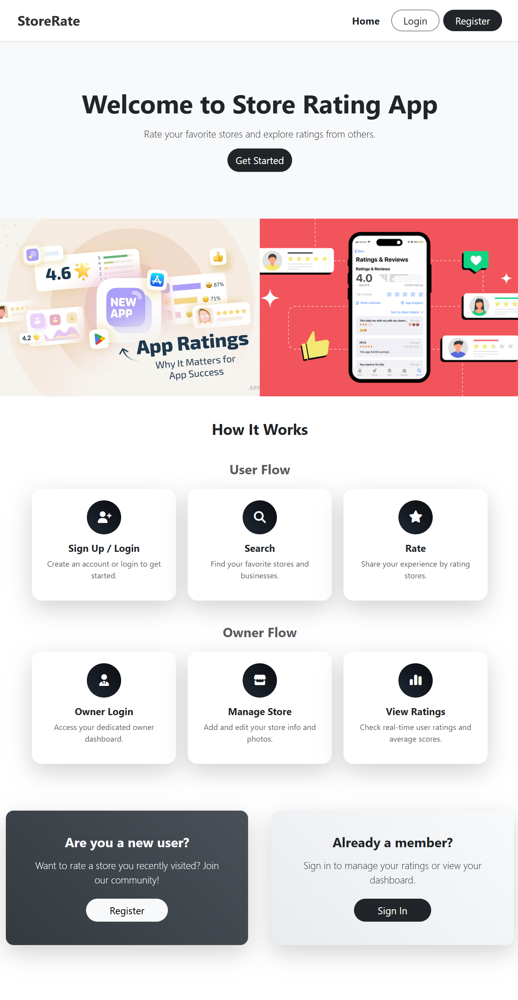
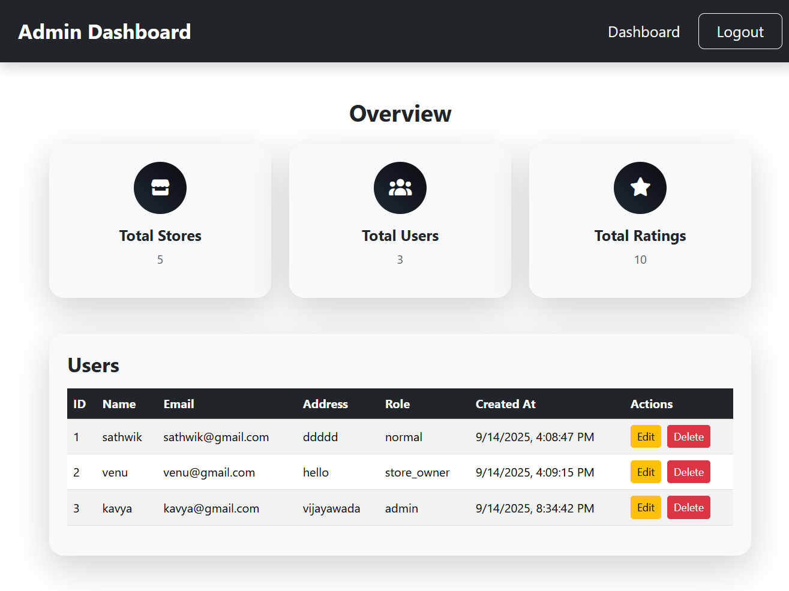
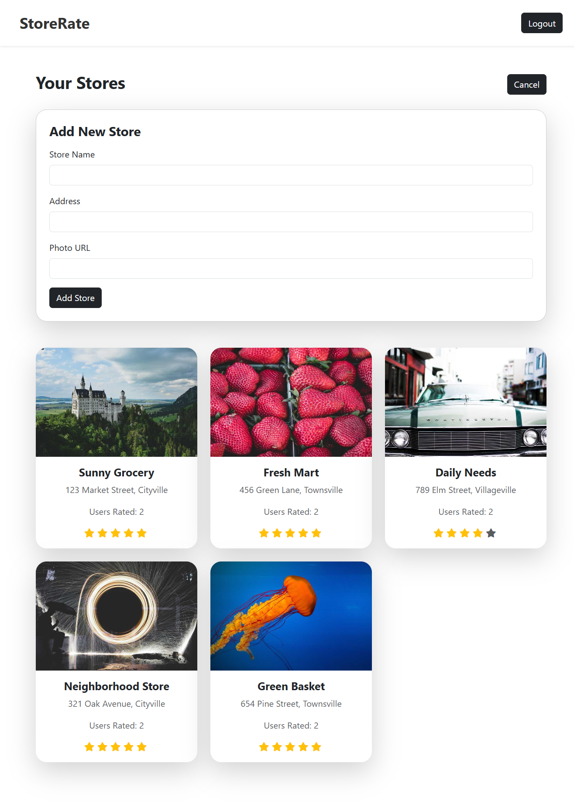
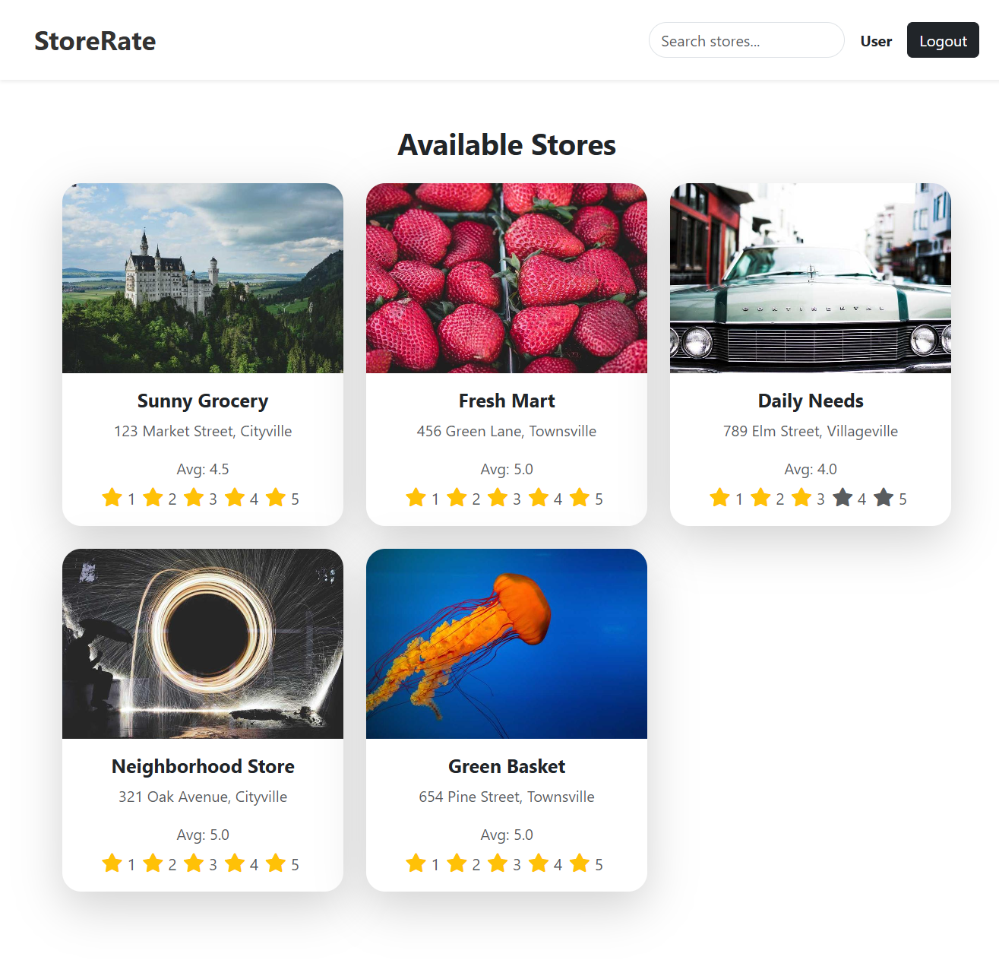

# MyStoreRating

## Project Overview
MyStoreRating is a web application for rating stores, managing users, and providing dashboards for admins, store owners, and normal users. It is built using **React (frontend)** and **Node.js/Express (backend)**.

## Features
- User authentication and roles (Admin, Store Owner, Normal User)
- Admin dashboard for managing users and stores
- Store owner dashboard to manage store ratings
- User dashboard to view and rate stores
- Responsive UI

## Screenshots

### Home / Store List


### Admin Dashboard


### Store Owner Dashboard


### User Dashboard


## Installation

1. Clone the repo:
```bash
git clone https://github.com/PavaniSathwik/MyStoreRating.git
